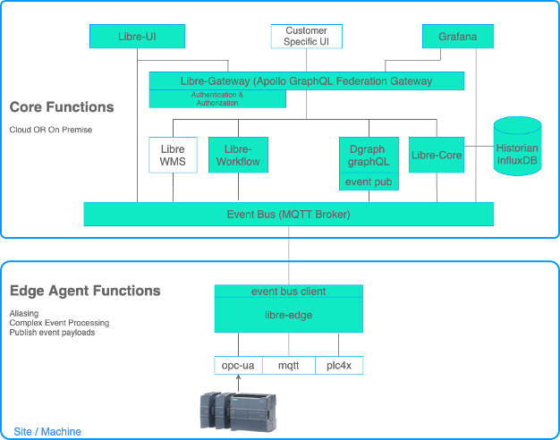

# Libre Core - Getting Started
Instructions and docker-compose for getting started 

## NOT FOR PRODUCTION ENVIRONMENTS. 
The software contained in this project, and the images pulled by the docker-compose file contained in this repo are pre-release versions and are not intended for production environments. Use of this software is at your own risk.

If you would like to use Libre in a production environment, please get in touch with Libre Technologies to ensure you have the correct stable versions of services for you specific needs.

## What does the docker-compose include?

#### Databases
* Dgraph - The store for all non-time-series data in the Libre platform. Dgraph is a schema driven, GraphQL native, open-source database.
* Influxdb - The leading open-source time-series database
#### MQTT Broker
* EMQX - The MQTT Broker used in the platform. We use EMQX because it has great support for clustered, highly available deployments in kubernetes
#### Dashboard Tool
* Grafana v8
#### Simulator
* Spruik PackML Simulator - Simulates a production line that produces PackML compliant data sets
#### Libre Platform
* Libre Administration UI
* libre-core microservice
* libre-server microservice
* graphql-pubsub microservice
* libre-workflow-pubsub microservice
* libre-gateway

## INSTALLATION ##
1. Download this repository
  
  * If you download the ZIP, make sure to unzip it and move it to your preferred location
2. Install docker
  * Windows: 
    * https://docs.docker.com/desktop/windows/install/
    * https://docs.microsoft.com/en-gb/windows/wsl/install-win10#step-4---download-the-linux-kernel-update-package (steps 1-5)
  * Mac: https://docs.docker.com/desktop/mac/install/
  * Linux: https://docs.docker.com/engine/install/
3. Run docker service
  * Navigate to your local installation on a terminal
  * Navigate to getting-started/standalone
  * Run the command: docker compose up
